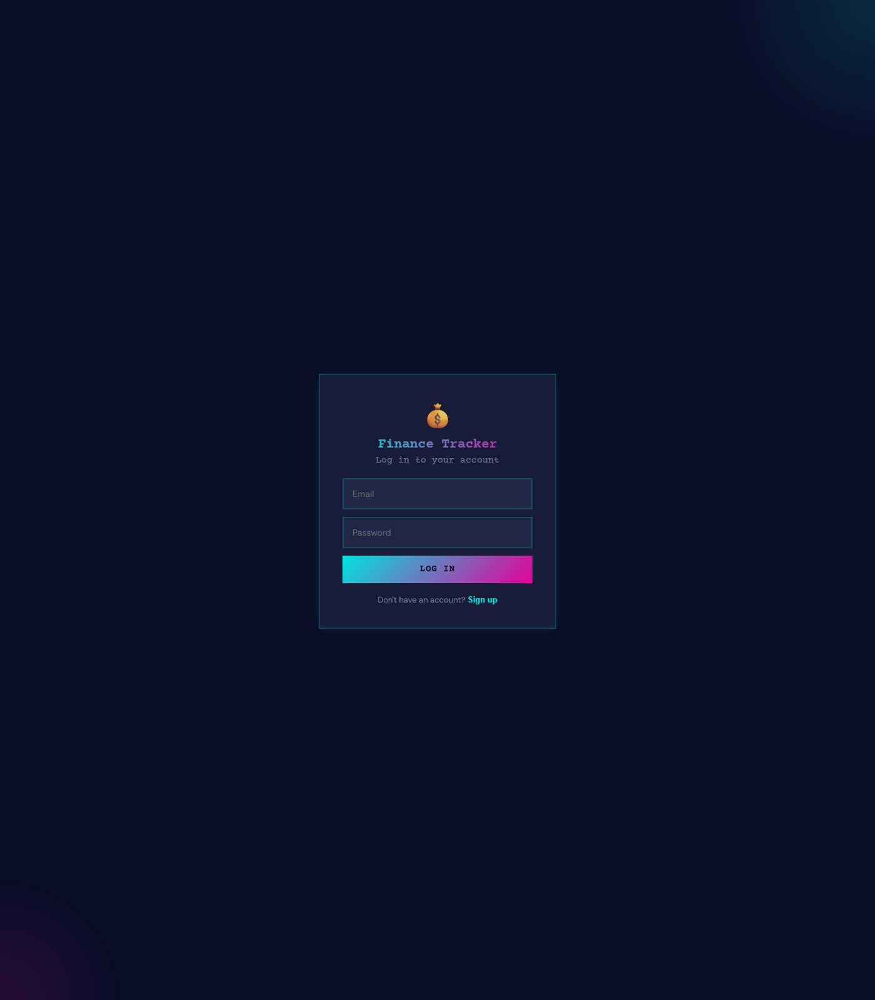
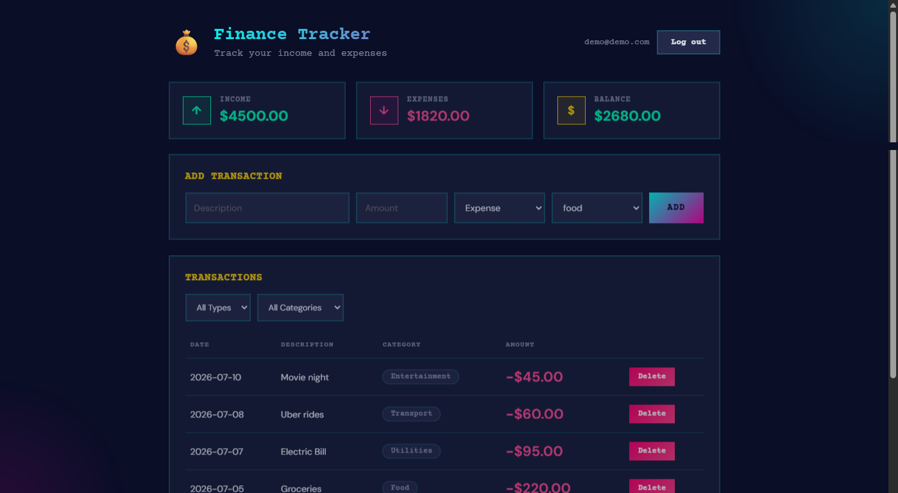

# Finance Tracker

A full-stack expense tracker with accounts, categorized transactions, and a spending breakdown chart — styled with a dark neon theme.

**Live app:** https://expense-tracker-starter-ten.vercel.app

<p>
  
  
</p>

## Features

- Email/password authentication with JWT sessions
- Add, filter, and delete income/expense transactions by category
- Live summary cards for income, expenses, and balance
- Spending-by-category pie chart
- Per-user data — every account only sees its own transactions

## Tech stack

| Layer | Stack |
|---|---|
| Frontend | React 19, Vite, Recharts |
| Backend | Node.js, Express, Prisma |
| Database | PostgreSQL |
| Auth | JWT, bcrypt |

## Project structure

```
├── src/            # React frontend
├── server/         # Express API
│   ├── prisma/     # Schema + migrations
│   └── src/        # Routes, middleware
└── public/
```

## Running locally

Requires Node.js and a PostgreSQL database (a local one via Docker works fine).

**1. Backend**

```bash
cd server
npm install
cp .env.example .env   # fill in DATABASE_URL, JWT_SECRET, FRONTEND_URL
npx prisma migrate deploy
npm run dev             # http://localhost:3001
```

**2. Frontend** (from the project root, in a separate terminal)

```bash
npm install
cp .env.example .env   # set VITE_API_URL to the backend URL
npm run dev              # http://localhost:5173
```

## Deployment

This project runs on three free-tier services:

- **Frontend** — [Vercel](https://vercel.com)
- **Backend** — [Render](https://render.com) (Node web service, root directory `server`)
- **Database** — [Neon](https://neon.tech) (serverless Postgres)

Environment variables:

| Where | Variable | Purpose |
|---|---|---|
| Frontend | `VITE_API_URL` | Backend base URL |
| Backend | `DATABASE_URL` | Postgres connection string |
| Backend | `JWT_SECRET` | Signs auth tokens |
| Backend | `FRONTEND_URL` | Allowed CORS origin |

> The Render free tier spins down after 15 minutes of inactivity — the first request after a break can take 30-60s to wake up.
